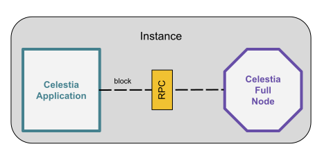

# Run Celestia Devnet
Note: This guideline is only relevant for the current devnet. As we approach to testnet, there will be a new guide

- [Run Celestia Devnet](#run-celestia-devnet)
  - [Celestia 101(Overview)](#celestia-101overview)
    - [Celestia Full Node](#celestia-full-node)
  - [Installation guide](#installation-guide)
  - [Troubleshoot](#troubleshoot)

## Celestia 101(Overview)
<i>Conceptually</i>, we have 2 main components in the network: 
1. `Celestia Full Node`
2. `Celestia Light Client`

<u>Note: When you see formated text of those 2 above</u>(`Celestia Full Node`, `Celestia Light Client`)<u>, remember that we are refering to a</u> <i>conceptual</i> <u>view.</u> Standard formated text <u>is a technical view </u>

### Celestia Full Node
When we are mentioning `Celestia Full Node`, we are relating to a combination of 2 components: 

- Celestia Application (lives in [celestia-app](https://github.com/celestiaorg/celestia-app) repo)
- Celestia Full Node (lives in [celestia-node](https://github.com/celestiaorg/celestia-node) repo)

<i>Conceptually</i>, one can't live without another as we need every new block to be erasure coded in order to do data availability sampling from `Celestia Light Clients`

<u>Technically</u>, Celestia Application and Celestia Full Node are operating on different processes of <b>one instance</b>(e.g. server). Let's break down what each of the parties do. 

Celestia Application(CA) takes care of these points: 
- Consensus
- State Interaction
- Block Production
- Communication between Celestia Application instances only!

Celestia Full Node(CFN) takes care of these points: 
- Sync blocks from Celestia App
- Erasure Codes the blocks
- Serve headers/shares to Celestia Light Clients
- Communication between Celestia Full Nodes and Celestia Light Clients

Communication of CA and CFN processes happens over the RPC. This diagram can help with wrapping the information. 

## Installation guide
<links here>

## Troubleshoot

