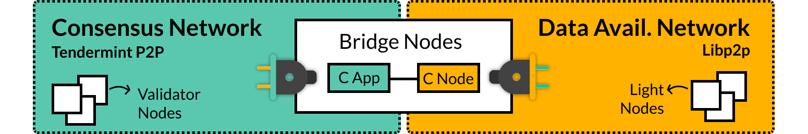

# Celestia Devnet
- [Quickstart](#quickstart)
- [Overview](#overview)
  - [Celestia Bridge Nodes](#celestia-validator-bridge-nodes)
  - [Celestia Light Nodes](#celestia-light-nodes)
- [Run a Light Node](#run-a-light-node)
- [Run a Bridge Node](#run-a-bridge-node)
- [Run a Validator Bridge Node](#run-a-validator-bridge-node)
- [Troubleshoot](#troubleshoot)

> Note: This guideline is only relevant for the current devnet. As we approach to testnet, there will be a new guide

## Quickstart

Devnet participants have the option of running:

1. [Light Nodes](#celestia-light-nodes) (low CPU, 5GB+ disk): [get started](#run-a-light-node)
2. [Bridge Nodes](#celestia-validator-bridge-nodes) (low CPU, 100GB+ disk): [get started](#run-a-bridge-node)
3. [Bridge Validator Nodes](#celestia-validator-bridge-nodes) (same node as 2): [get started](#run-a-validator-bridge-node)
4. _[Full DA Nodes](https://github.com/celestiaorg/celestia-node/blob/main/docs/adr/adr-003-march2022-testnet.md#full-node) are under development_

You can view chain activity at the current `devnet-2` explorer: https://celestia.observer/
## Overview

Devnet demonstrates Celestia’s data availability capabilities by running two individual but connected networks:

1. A libp2p **DA network** with [Bridge Nodes](#bridge-nodes) which relay and process blocks from the celestia-core network and [Light Nodes](#celestia-light-nodes), which do data availability sampling those blocks.
2. A p2p **Consensus network** with [**Validators Nodes**](#bridge-validator-nodes) (which are part of Bridge Nodes), that handles the underlying consensus and block production. 

> Note that mainnet may look very different from this devnet implementation, as the architecture continues to be improved. You can read more about devnet decisions here ([see ADR](https://github.com/celestiaorg/celestia-node/blob/main/docs/adr/adr-003-march2022-testnet.md)).

### Celestia (Validator) Bridge Nodes

Specifically, Bridge Nodes: 

1. Import and process “raw” headers & blocks from a trusted Core process in the Consensus network. Bridge Nodes can run this Core process internally or simply connect to a remote endpoint. Bridge Nodes also have the option of being an active validator in the Consensus network.
2. Validate and erasure code the "raw" blocks
3. Produce block shares with DA metadata to Light Nodes in the DA network.

From an implementation perspective, Bridge Nodes run two separate processes:

1. Celestia App with Celestia Core ([see repo](https://github.com/celestiaorg/celestia-app))
    - **Celestia App** is the state machine where the application and the proof-of-stake logic is run. Celestia App is built on [Cosmos SDK](https://docs.cosmos.network/) and also encompasses **Celestia Core**.
    - **Celestia Core** is the state interaction, consensus and block production layer. Celestia Core is built on [Tendermint Core](https://docs.tendermint.com/), modified to store (1) invalid transactions and (2) data roots of erasure coded blocks, among other changes ([see ADRs](https://github.com/celestiaorg/celestia-core/tree/master/docs/celestia-architecture)).
2. Celestia Node ([see repo](https://github.com/celestiaorg/celestia-node))
    - **Celestia Node** augments the above with a separate libp2p network that serves data availability sampling requests. The team sometimes refer to this as the "halo" network.

### Celestia Light Nodes

Specifically, Light Nodes:
1. Connect to a [Celestia Bridge Node](#celestia-validator-bridge-nodes) in the DA network. *Note: Light Nodes do not communicate with each other, but only with Bridge Nodes.*
2. Listen for `ExtendedHeader`s, i.e. wrapped “raw” headers, that notify Celestia Nodes of new block headers and relevant DA metadata.
3. Perform data availability sampling (DAS) on the received headers

## Run a Light Node

Light nodes (CLN) ensure data availability. This is the most ubiquitous way to interact with the Celestia network.
> Note: In future implementations, Light Nodes can also publish transactions ([see ADR](https://github.com/celestiaorg/celestia-node/blob/main/docs/adr/adr-004-state-interaction.md)), though in Devnet, transactions are left to Bridge Nodes.

**Installation**
- [Light Node Setup Guide](/celestia-light-node.md)
- Source code repository(s):
    - [celestia-node](https://github.com/celestiaorg/celestia-node)

## Run a Bridge Node

Bridge Nodes connect the aforementioned Consensus and DA networks.

**Installation**
- [Bridge Node Setup Guide](/celestia-bridge-node.md)
- Repositories:
    - [celestia-app](https://github.com/celestiaorg/celestia-app)
    - [celestia-node](https://github.com/celestiaorg/celestia-node)

## Run a Validator Bridge Node

Bridge Nodes have the option of validating the P2P network using its Celestia App component. However, running validator nodes is not a requirement to learn about Celestia’s main value proposition.

> Only the top 100 validators make it into the active validator set. The team is not looking for additional validators at the moment and recommend running light or bridge nodes instead.

**Installation**

- [Validator Setup Guide](celestia-bridge-node.md#running-a-validating-bridge-node)
- Repositories:
    - [celestia-app](https://github.com/celestiaorg/celestia-app)

## Troubleshoot
Please navigate to [this link](./troubleshoot.md) to find more details

